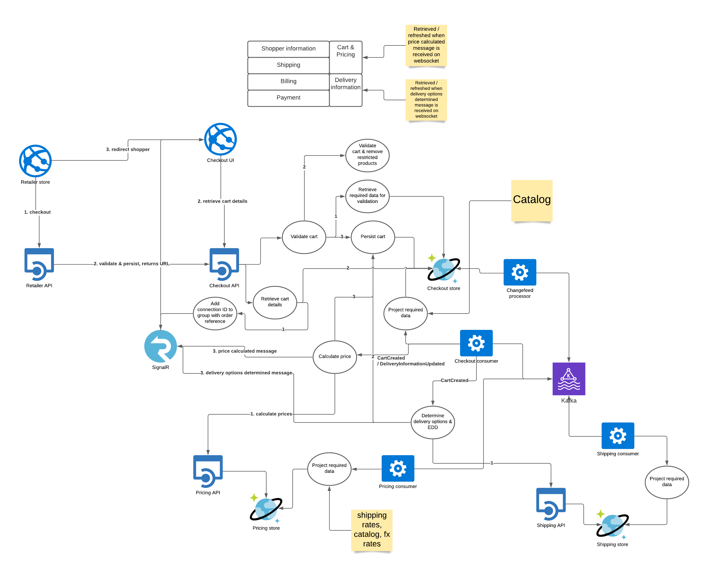
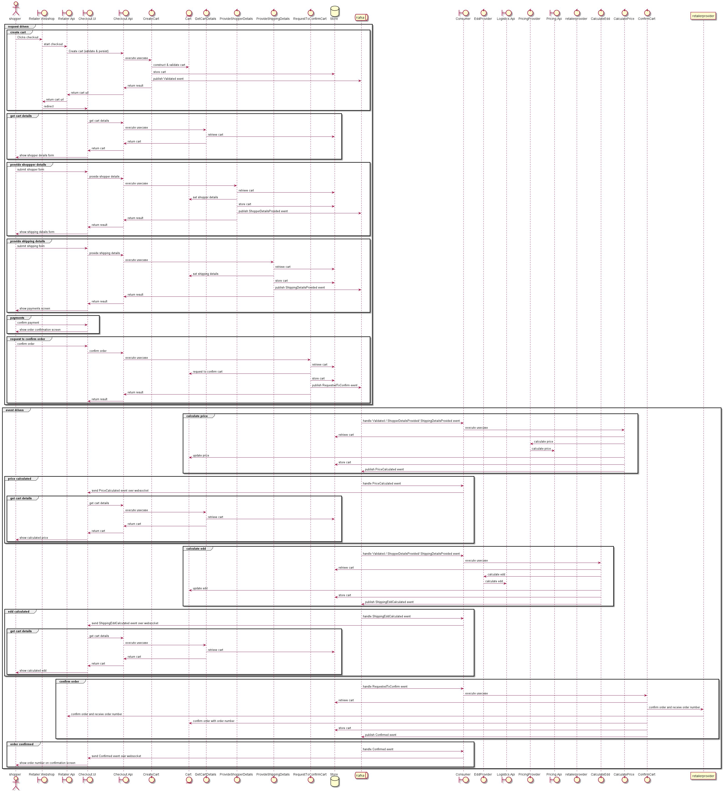
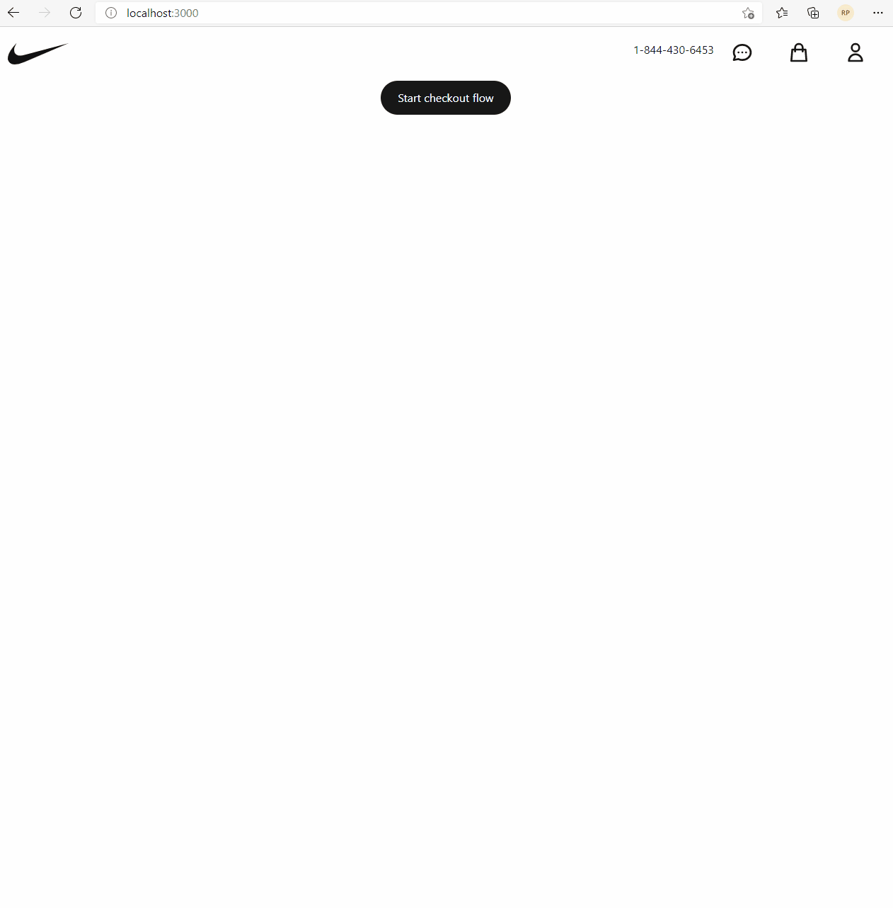

# Introduction

This is an proof of concept for a new approach to the checkout flow that's currently used by one of the companies I worked for, to prove its feasability to the organisation.

The purpose of this solution is to try out an asynchronous version of the current checkout flow to see how it would impact the UX, using the technologies outlined below.

## checkout.api

- Using .NET Framework 5
- Using Masstransit for both its Kafka Rider (https://masstransit-project.com/usage/riders/kafka.html) and its Mediator (https://masstransit-project.com/usage/mediator.html)
- Using Ardalis.ApiEndpoints instead of the standard MVC controllers for the RESTful API: https://github.com/ardalis/ApiEndpoints. See https://garywoodfine.com/developing-apis-using-http-endpoints/ for more background and information on how to use.
- Using SignalR for the websocket communication with the JS client
- Using a dumbed down version of the clean architecture

## checkout.ui

- Using React with functional components & hooks
- Using Next.js (https://nextjs.org/)
- Using Tailwind CSS for the styling (https://tailwindcss.com/, it's the shit)

## notes

"Some" shortcuts have been taking for this poc, like:

- directly exposing the domain model on the API (always use different models per layer (domain, application & api / web) to accomodate for versioning)
- directly publishing the event from the use case, decouple this action using a changestream mechanism on the store
- using Automapper. [Automapper](https://sietch.net/ViewNewsItem.aspx?NewsItemID=260) [is](https://cezarypiatek.github.io/post/why-i-dont-use-automapper/) [the](https://www.aloneguid.uk/posts/2015/12/automapping/) [worst](https://davecallan.com/automapper-doesnt-save-time/). But I was lazy, and stuck for time, and it's a proof of concept.
- when the UI receives the websocket message that the price / edd has been calculated it'll retrieve the new cart state by calling the API. This'd be pretty inefficient, it's better to pass the new price / edd details on the websocket message, as what's done with the Confirmed message (which contains the retailer's order reference).
- 1 store used for both write & read, this solution would lend itself well to use event based storage for the write store, then project the aggregate's events to the read store (event sourcing + CQRS).

# Running the proof of concept

To run the full solution you'll have to run both the checkout.api service and the checkout.ui application. You'll also need both MongoDB and Kafka available.

## running required infrastructure

- Running Kafka locally: https://eshopworld.atlassian.net/wiki/spaces/EPLT/pages/2345468070/Local+development
- After that to run MongoDB locally execute the following commands:

```
docker volume create --name=mongodata
docker run --name mongodb -v mongodata:/data/db -d -p 27017:27017 mongo
```

The checkout.api is configured to connect to the Kafka broker on localhost:9092, and MongoDB on localhost:27017.

## running checkout.api

- make sure the latest version of .NET Framework 5 is installed on your machine
- go to the folder checkout.api/api using your preferred terminal
- execute the command `dotnet run`

The project's swagger page should be available on http://localhost:5000 afterwards.

## running checkout.ui

- go to the folder checkout.ui
- execute the command `yarn` (or `npm` if you prefer using npm)
- execute the command `yarn dev` (or `npm run dev` if you prefer using npm)

The app will be running on http://localhost:3000 afterwards.

## tips

- The checkout.api exposes an action called `/api/latency` which allows you to set the mocked latency of calculating the price and EDD for the cart, which will affect how long the UI has to wait for the notification telling it the price / EDD has been calculated.

# Rational

This approach was presented as option 5 for the calculator approach when presenting the **F**uture **S**tate **A**rchitecture, but there was a worry around the UX for the shopper on the product side. Hopefully this proof of concept will alleviate some of the concern.
The pros and cons for this approached were outlined as below.

**Pros**:

- We can still abide to the 1-hop rule for increased scalability and decoupling of the solution
- We can update the structure & logic of the calculations for all domains in a single place by redeploying the calculator
- No duplication of code required

**Cons**:

- Degraded shopper experience where if the load is high the shopper might see a spinner before seeing the actual price of the cart.
- Increased UI complexity
- Increased complexity as we’re trying to build a calculation model & view that will fit all purposes

The current approach of using NuGet packages containing an SDK for the lookup of locally projected reference data (FX rates, catalog data, etc.) has a downside as it ties the deployment of the various services together:

- if the NuGet package gets updated all the consumers have to be redeployed at once. (https://phauer.com/2016/dont-share-libraries-among-microservices/, https://medium.com/standard-bank/microservices-dont-create-shared-libraries-2e803b033552).
- It restricts our ecosystem to only .NET based microservices, messing with the polyglot nature of our microservices based solution.

If we instead make sure our frontend is as asynchronous as our backend will be we can still have a centralized calculator service while still adhering to the 1-hop principle for services to promote decoupling. If the calculator service goes down it means checkout can still continue to handle its checkout flow, but the breakdown of the price won't work. In terms of scaling it still means that if checkout has a lot of transactions to handle we can expect we'll have to scale out the calculator as well, but they're independent operational services instead of being tightly coupled together.
In a future, future state of the solution where the teams are capable and confident of creating & maintaining their own UI apps a micro-frontend approach can be considered, where the checkout UI will be an aggregated view consisting of the following federated modules:

- price view
- EDD view
- ID collection
- payment
- screens to support the checkout flow
  These can be released & evolved indepedently of each other.

## topology diagram

_Adding a SignalR hub to your service adds a lot of additional client connections that have to be sticky. You can use a Redis instance to scale this out across multiple instances, but the most efficient solution is to use Azure SignalR Service (https://azure.microsoft.com/en-us/services/signalr-service/)._
_A potential alternative to using SignalR is to switch to using GraphQL instead, which comes with a subscription option that allows clients to be notified of certain dataset changes (also over websocket)._



## sequence diagram



## recording


